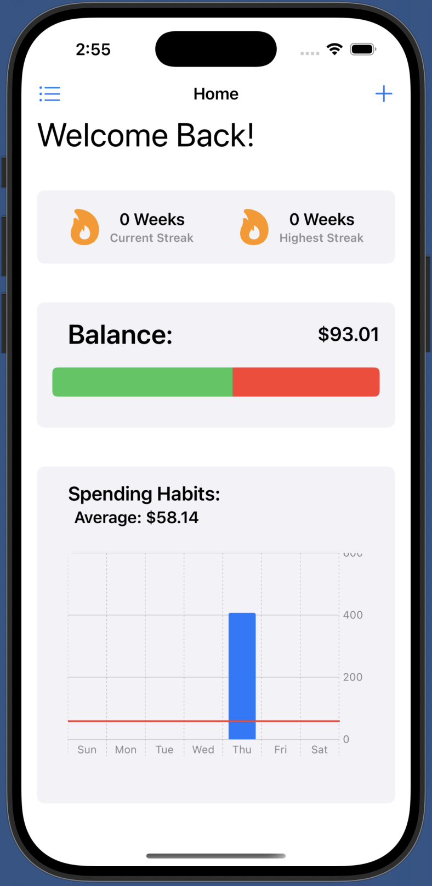
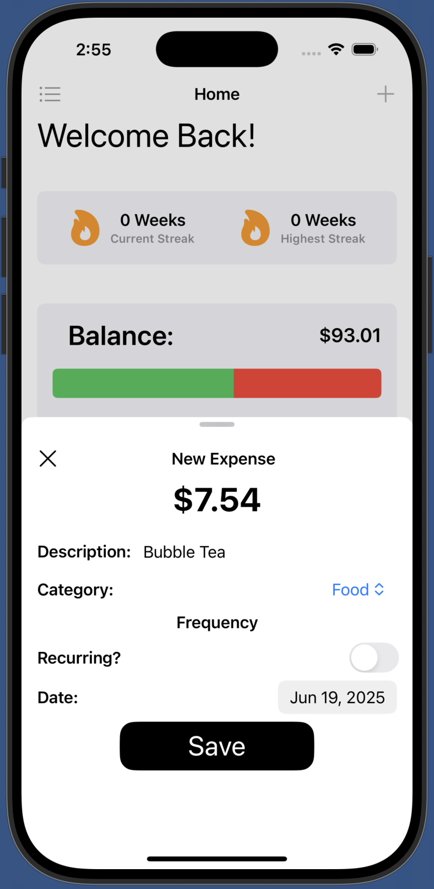
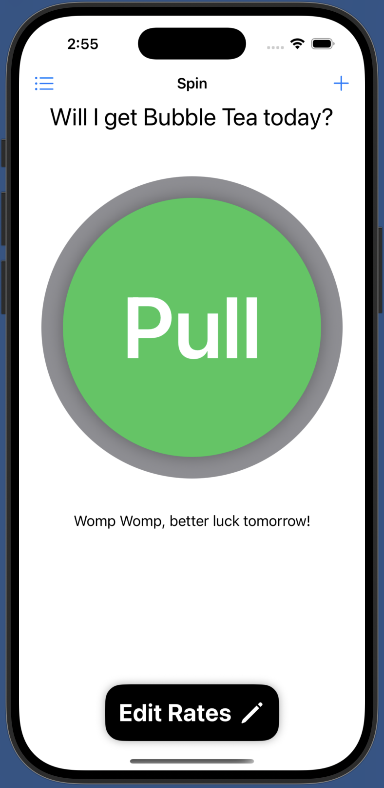
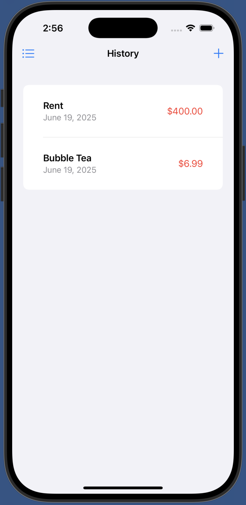
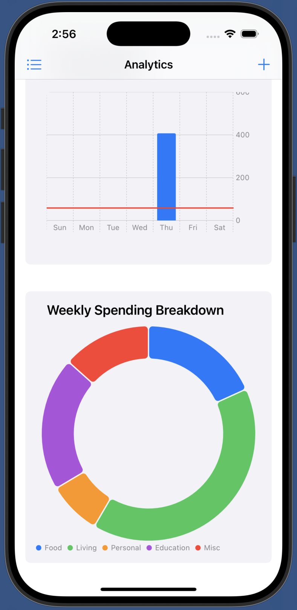

# CS Final Project - BudgetUni

Sick and tired of eating just instant noodles in your room everyday because school is expensive and you can't manage funds properly?
Introducing BudgetUni!
BudgetUni is a Swift application designed to help university students better manage their spending habits.

## Features

- budgeting calculator
- weekly/ daily spending allowance
- maps to see nearby areas of interest
- daily gacha element where users can set a prize and frequency that they get the prize
- charts to show whether you are staying on budget or not
- user input system to track spending and saving

## Some Photos of the App

<table>
  <tr>
    <td></td>
    <td></td>
    <td></td>
    <td></td>
    <td></td>
  </tr>
</table>
